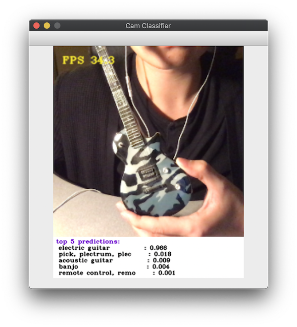
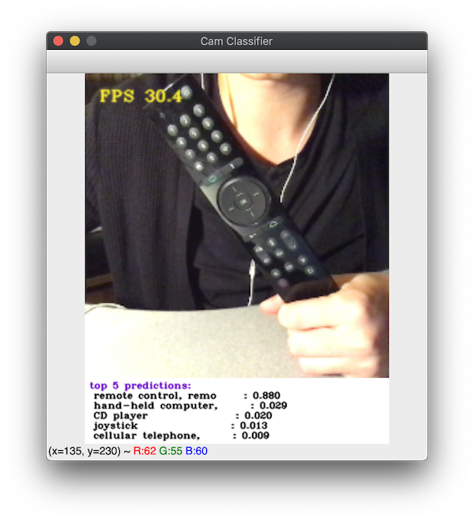

# Computer vision with webcam

- Zhijin Li

This project contains implementations of various computer vision
applications for webcam. Models used in this repo run in inference
mode, with weights obtained from official online public
repositories. The possibility of retraining or finetuning the models
using customized dataset is out-of-scope of this repo.

All codes were developped and tested on a 15-inch MacBook Pro
(mid-2018). An effort was made so that the applications in this repo
run at at least around 30 frames per second (fps). Content of this
repo is detailed Hereunder.

## Repo structure

- `cam-*.py` files refer to different applications. It can be run in a
  terminal by typing `./cam-*.py`.
- `lib` folder contains source code for the applications.
- `data` folder contains images and files describing models and
  datasets used in this repo. Some large data, such as model weights
  and additional images will be downloaded into this folder when
  certain applications are launched for the first time.
- `ChangeLog`: change tracker.
- `AUTHORS`
- `LICENSE`
- `README.md`

## Camera capture utilities

A utility for real-time camera capturing is provided in `lib/utils`
under the name `capture.py`. It can be launched in a terminal. In this
case a demo frame capturing real-time camera feed will pop up. FPS
measurement is printed at the top-left corner of the frame. This file
is also imported as a module in other applications, providing utility
APIs related to threaded frame capturing, frame trimming and
application-specific frame modifications.

### Dependencies

- `opencv-python`
- `numpy`

## Object classification with `cam-classify`

Classifiy object from real-time webcam feed.

This application uses
[`MobileNet`](https://arxiv.org/pdf/1704.04861.pdf) from the official
[`tf.keras.applications`](https://keras.io/applications/#mobilenet)
with weights pre-trained on `ImageNet`.

### Usage

Run

    ./cam-classify.py

in a terminal.

### Dependencies

- `opencv-python`
- `numpy`
- `tensorflow`

## Object detection with `cam-detect`

Detect objects from real-time webcam feed.

This application implements
[`YOLOv3-tiny`](https://pjreddie.com/media/files/papers/YOLOv3.pdf)
architecture in `pytorch` for object detection. The model weights was downloaded
from the official [`darknet`
website](https://pjreddie.com/darknet/yolo/). An effort was made to
replicate the result of the original `darknet` implementation,
with maximum absolute difference between detection feature-maps from
two implementation bounded by $10^{-4}$, when the darknet
pre-processed images are used as input.

### Usage

Run

    ./cam-detect.py <--run_test> <--use_darknet_boxes>

in a terminal.

- `--run_test` is an optional argument. When specified, the
  application will run on a series of `darknet` test images and
  display the results.
- `--use_darknet_boxes` is an optional argument and can be added in
  additiona to `--run_test`. When specified, the application will use
  `darknet` pre-processed (letter box transformed) images as input. An
  utility program `make_letter_boxes` is provided under `tool/darknet`
  to transform color images to Darknet style letter boxes. To use this
  utility, go to `tool/darknet`, run

        make

  to compile the program. Then run

        ./make_letter_boxes ../../data/darknet-test-images/ jpg

  The program will save letter box transformed images under the
  directory `data/darknet-test-images`.

### Dependencies

- `opencv-python`
- `numpy`
- `torch`, `torchvision`
- `requests`
- [`darknet`](https://pjreddie.com/darknet/install/) compiled &
  installed (only for `make_letter_boxes` utility)
